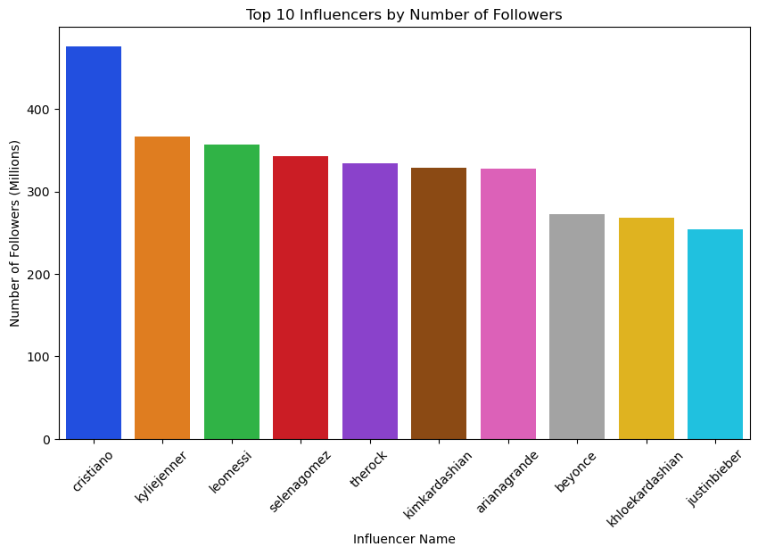

```python
import warnings
import pandas as pd
import pandas.errors as pe
import numpy as np
import matplotlib.pyplot as plt
import seaborn as sns


warnings.filterwarnings('ignore', category=pe.SettingWithCopyWarning)


df = pd.read_csv(r'C:\Users\at2sm\OneDrive\Desktop\Project 1\top_insta_influencers_data.csv')


df['followers_count'] = df['followers_count'].str.replace('m', '')


df['followers_count'] = pd.to_numeric(df['followers_count'], errors='coerce')


df.sort_values(by=['followers_count'], ascending=False, inplace=True)


top_10_influencers = df.iloc[:10, :]


input_names = top_10_influencers['channel_info'].to_list()


top_10_influencers.loc[:, 'input_name'] = input_names


plt.figure(figsize=(10, 6))
sns.barplot(
    x="input_name",
    y="followers_count",
    data=top_10_influencers,
    palette="bright",
)


plt.xticks(rotation=45)


plt.title("Top 10 Influencers by Number of Followers")
plt.xlabel("Influencer Name")
plt.ylabel("Number of Followers (Millions)")

plt.show()


```


    

    


```python

```
